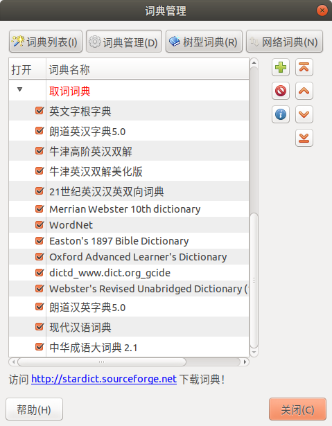

>  http://proxy.grandsoft.com.cn/wpad.dat
>
>  ```
>  proxy.grandsoft.com.cn:3128
>  192.168.0.119:3128
>  ```

---

>  https://mirrors.tuna.tsinghua.edu.cn/help/ubuntu/
>  https://mirrors.tuna.tsinghua.edu.cn/help/pypi/
>
>  ```bash
>  sudo -H python3 -m pip install -U pip # python3 -m pip install -U pip
>  python3 -m pip install -i https://pypi.tuna.tsinghua.edu.cn/simple -U pip
>  pip3 config set global.index-url https://pypi.tuna.tsinghua.edu.cn/simple
>  ```

---

>https://blog.csdn.net/u013468614/article/details/103734770
>https://blog.csdn.net/cosmoshua/article/details/76644029
>
>`vi ~/.bashrc`: alias(python pip) PS1(w->W)
>
>pinyin input; `sudo dmidecode > hd.txt`; `ffplay --help > ffplay.txt`
>
>NVIDIA: Driver, CUDA, cuDNN, TensorRT

---


> **Eudic**: https://www.eudic.net/v4/en/app/download
>
> `sudo dpkg -i`: chrome, vscode, nomachine, baidunetdisk
>
> **Typora**: http://support.typora.io/Typora-on-Linux/
>
> ```bash
> sudo apt-key adv --keyserver keyserver.ubuntu.com --recv-keys BA300B7755AFCFAE
> OR: wget -qO - https://typora.io/linux/public-key.asc | sudo apt-key add -
> 
> sudo add-apt-repository 'deb https://typora.io/linux ./'
> sudo apt-get update; sudo apt-get install typora
> 
> wget - c https://typora.io/linux/typora_0.9.96_amd64.deb; 
> sudo dpkg -i typora_0.9.96_amd64.deb
> ```
>
> ```bash
> sudo add-apt-repository ppa:atareao/telegram
> sudo apt update && sudo apt install telegram virtualenv
> sudo apt install vim python3-pip git cmake htop net-tools tree pandoc
> sudo apt install stardict meld calibre xchm pavucontrol audacity kazam
> sudo apt install openssh-server sshfs unrar; sudo service ssh start
> sudo apt install python3-venv gnome-tweaks gnome-shell-extensions
> sudo apt install libfreeimage3 libfreeimage-dev # install FreeImage
> virtualenv -p /usr/bin/python3 env; source env/bin/activate; deactivate
> ```

---

> http://wiki.ros.org/cn/melodic/Installation/Ubuntu
>
> `pip3 install catkin_pkg pyyaml empy rospkg`

---


> ```bash
> sudo pip3 install ipython virtualenv # python -m virtualenv `xxx`
> pip3 install torch==1.6.0 torchvision==0.7.0 pyqt5
> pip3 install cython open3d matplotlib pillow labelme filterpy
> pip3 install opencv-python torchsummary pycuda pycocotools
> 
> git clone https://github.com/cocodataset/cocoapi.git
> cd cocoapi/PythonAPI/; python setup.py install
> ```

---

> ```bash
> pip3 install SpeechRecognition
> sudo apt-get install python3-pyaudio
> pip3 install pyttsx3 playsound pydub
> sudo apt install python3-espeak # ffmpeg espeak libespeak1
> sudo apt install tcl-dev tk-dev python3-tk # No module named 'tkinter'
> sudo apt install libopencv-core-dev libopencv-highgui-dev libopencv-calib3d-dev libopencv-features2d-dev libopencv-imgproc-dev libopencv-video-dev # install pre-compiled OpenCV libraries
> ```

---

> ```bash
> pip3 install mediapipe
> pip3 install facenet-pytorch
> pip3 install mtcnn-pytorch # optional
> ```

---

> ```bash
> git config --list
> 
> git add -A; git status; git commit --amend
> git push --force-with-lease origin master
> 
> git fetch --all # OR: git fetch origin master
> git reset --hard origin/master
> 
> git reset --hard HEAD^; git pull --force
> ```

---

**Qv2ray for Ubuntu:**

> https://qv2ray.net/en/getting-started/
>
> https://qv2ray.net/en/getting-started/step1.html#github-releases-binary
>
> https://qv2ray.net/en/getting-started/step2.html#configure-v2ray-core-in-qv2ray
>
> https://qv2ray.net/en/getting-started/step3.html#subscription
>
> https://qv2ray.net/en/plugins/usage.html#how-to-download-and-use-a-plugin

> https://github.com/v2fly/v2ray-core/releases
>
> https://github.com/Qv2ray/Qv2ray/releases/latest
>
> https://github.com/Qv2ray/QvPlugin-Trojan/releases

1. Download the [AppImage](https://github.com/Qv2ray/Qv2ray/releases/download/v2.6.3/Qv2ray.v2.6.3.linux-x64.AppImage) of Qv2ray, and `chomd +x *.AppImage`
2. Download and unzip [v2ray-core.zip](https://github.com/v2fly/v2ray-core/releases/download/v4.33.0/v2ray-linux-64.zip), then try to `mv` it as `~/.config/qv2ray/vcore`.
3. Run Qv2ray, and click [`Preference`->`Kernel Settings`](https://qv2ray.net/en/getting-started/step2.html#configure-v2ray-core-in-qv2ray), then set `Core Executable Path` and `V2Ray Assets Directory`.
4. Download [Trojan plugin](https://github.com/Qv2ray/QvPlugin-Trojan/releases/download/v2.0.0/QvTrojanPlugin.v2.0.0.linux-x64.so), and click [Plugins->Click Open Local Plugin Folder](https://qv2ray.net/en/plugins/usage.html#how-to-download-and-use-a-plugin), then mv the downloaded `*.so` file to `~/.config/qv2ray/plugins`, then restart Qv2ray.
5. Add hosts: 1. click `New`, paste hosts into `Link`; 2. [add subscription](https://qv2ray.net/en/getting-started/step3.html#subscription): subscribe to [cdp2020](https://raw.githubusercontent.com/cdp2020/v2ray/master/README.md). 

> **Fail to update [cdp2020](https://raw.githubusercontent.com/cdp2020/v2ray/master/README.md)** : `sudo gedit /etc/hosts`, append a new line of `151.101.84.133 raw.githubusercontent.com`, save and close, update the subscription.

> Ref: https://www.ipaddress.com/
> https://site.ip138.com/raw.githubusercontent.com/
> https://www.cnblogs.com/sinferwu/p/12726833.html

---

> **v2rayN for Win10:** MUST run `v2rayN.exe` as Administrator.

---

> ```bash
> cat /etc/group|grep sudo # list all sudoers
> 
> sudo adduser xxx # create user `xxx` without/with sudo
> sudo useradd -m -d "/home/xxx" -s "/bin/bash" -G sudo xxx; sudo passwd xxx
> 
> sudo usermod -aG sudo xxx # gain user sudo/27 privileges
> e.g. sudo usermod -aG docker $USER; newgrp docker
> sudo gpasswd -a xxx sudo # OR: replace all `sudo` with `27`
> 
> sudo gpasswd -d xxx sudo # remove user sudo privileges
> sudo usermod -G xxx xxx # remove all supplementary GROUPS
> sudo deluser xxx sudo # remove `xxx` from sudo group
> 
> sudo userdel -rf xxx # remove user `xxx` and its home
> ```

---

> ```bash
> sudo su; cd /home; mv xxx hua # rename user: `xxx` to `hua`
> sudo gedit /etc/group # replace all `xxx` with `hua`
> sudo gedit /etc/passwd # replace all `xxx` with `hua`
> sudo gedit /etc/shadow # replace all `xxx` with `hua`
> ```

---

> ```bash
> sudo docker image ls # docker images; docker image --help
> sudo docker image rm -f xxx # remove image_id forcely
> sudo docker image prune -a # remove all unused images
> sudo docker pull opendronemap/odm:2.8.3 # docker --help
> sudo docker tag opendronemap/odm:2.8.3 opendronemap/odm:latest
> ```

---

> ```bash
> sudo su; cd / # Backup system
> tar -cvpzf /home/backup.tgz --exclude=/home/backup* --exclude=/proc --exclude=/tmp --exclude=/lost+found --exclude=/media --exclude=/mnt --exclude=/run /
> tar tvf backup.tgz | grep xxx
> ```

---

> **Custom monitor(1920x1080) or remote(1600x900):**
>
> ```bash
> cvt 1600 900 # get modeline for `xrandr --newmode`
> xrandr  # list monitor name: such as `VGA-1 ` for `xrandr --addmode`
> ```
>
> **Temp**: 
>
> ```bash
> sudo xrandr --newmode "1600x900_60.00"  118.25  1600 1696 1856 2112  900 903 908 934 -hsync +vsync; sudo xrandr --addmode VGA-1 "1600x900_60.00"
> ```
>
> **Permanent**: `sudo vi /etc/profile`
>
> ```
> xrandr --newmode "1600x900_60.00"  118.25  1600 1696 1856 2112  900 903 908 934 -hsync +vsync
> xrandr --addmode VGA-1 "1600x900_60.00"
> ```

---

> **For cv2+matplotlib on Jetson:** `sudo apt-get install python3-gi`
>
> ```python
> import matplotlib, gi
> matplotlib.use('TkAgg') #'Agg'
> gi.require_version('Gtk','2.0')
> ```
>
> **Start ipython with matplotlib/pylab**: `ipython --matplotlib`, `ipython --pylab`

---

> https://blog.csdn.net/gatieme/article/details/71056020
>
> `sudo visudo`：`Defaults env_reset, timestamp_timeout=-1` # [x] minutes, -1=forever.

---

> https://pypi.org/help/#invalid-auth
> https://zhuanlan.zhihu.com/p/115302375
>
> ```bash
> pip3 install -U setuptools twine wheel --user
> # upload `sdist` first for markdown display, then upload `bdist`.
> python3 xxx/setup.py sdist; twine upload xxx/dist/* # 1st
> python3 xxx/setup.py bdist_wheel; twine upload xxx/dist/* # 2nd
> python3 setup.py install # python3 setup.py develop
> pip3 install xxx/dist/*.tar.gz # pip3 install xxx/dist/*.whl
> ```

---

> ```bash
> scp -rpq aic@10.20.64.16:/home/aic/xxx ~/yyy
> 
> ssh hua@10.20.64.15 -X # aic@10.20.64.16
> ssh xxx@bjfm.glodon.com -p60022 # wH8JZMX(R$MYN-Jk
> 
> sudo sshfs -o allow_other hua@10.2.56.138:/home ~/HUA
> sudo sshfs -o allow_other hua@10.1.191.183:/home ~/NX
> sudo sshfs -o allow_other hua@192.168.10.107:/home ~/NX
> sudo sshfs -o allow_other jetson@192.168.10.126:/home ~/AGX
> 
> smb://10.2.54.20 # require: username, password, domain=GRANDSOFT
> sudo mount -t cifs //10.2.54.20/share ~/kkk -o username=xxx,password=xxx,domain=GRANDSOFT
> ```

---


$$
\mathbf{V}_1 \times \mathbf{V}_2 =  \begin{vmatrix} 
\mathbf{i} & \mathbf{j} & \mathbf{k} \\
\frac{\partial X}{\partial u} &  \frac{\partial Y}{\partial u} & 0 \\
\frac{\partial X}{\partial v} &  \frac{\partial Y}{\partial v} & 0 \\
\end{vmatrix}
$$

---

> `sudo mv * /usr/share/stardict/dic`
>
> 
